# Autonomous Drone Perception System

# Overview

This project develops a state estimation system for an autonomous drone using an Extended Kalman Filter (EKF), provides a C++ implementation of this system and performs adjustments of the system parameters in a flight simulator.

The system developed in this project is based upon a methodology by TELLEX, BROWN and LUPASHIN [1].

This project is part of Udacity's Autonomous Flight Engineer Nanodegree [2]. This README serves as a final report for the project.

 

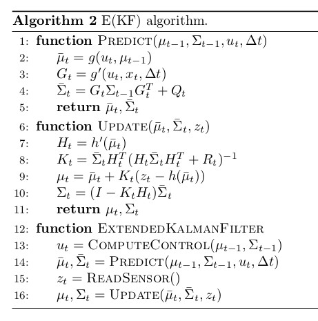

  

# Safety First!

1 - This project is educational only. The methodology used in this project was only used in the Udacity C++ flight simulator and not validated on a real drone.

2 - Only tune the parameters of your drone by following the procedure prescribed by your drone’s manufacturer.

3 - Make sure you comply with your local regulations before flying a drone.

4 - This project makes several assumptions which may not apply on a real drone.

# Install & Run

1 - Clone this repository

	$ mkdir -p /drone/projects/perception
	$ cd /drone/projects/perception
	$ git clone https://github.com/martin0004/drone_perception_system.git

2 - Install QTCreator and the GLUT libs

	$ sudo apt install qtcreator
	$ sudo apt install qtbase5-examples    # optional - qt examples
	$ sudo apt install qtbase5-doc-html    # optional - qt examples documentation
	$ sudo apt install freeglut3-dev

3 - Compile the project.

	$ cd /drone/projects/perception    # Make sure you open qt from here when compiling
	$ qtcreator                        # This will launch QTCreator

	File > Open File Or Project > simulator/project/CPPSim.pro
	Click on tab Edit on the left side panel of QTCreator
	Right click on CPPSim > Run qmake
	Right click on CPPSim > Run

4 - You should now see a drone hover. Right click on the simulation to switch between scenarios.

5 - Look into file `QuadEstimatorEKF.txt` to find all perception system parameters. If you change a value in this file and save it, the drone behavior will change in the simulation (no need to close the simulator, just update and save the file). Try to find better system parameters!

# [Optional] Udacity Starter Code

Udacity provided students with some starter code. This starter code can be installed with the following procedure.

	mkdir -p /drone/projects/perception/udacity_starter_code
	cd /drone/projects/perception/udacity_starter_code
	git clone https://github.com/udacity/FCND-Estimation-CPP

# Udacity C++ Flight Simulator

Parameters of the system developed in this project were tweaked by flying a drone in a series of scenarios in the Udacity C++ flight simulator [3]. The tuning scenarios are described in section “Validation”.

The flight simulator itself is a small QT application. The flying area is about 5 m x 5 m and the scenarios last only a few seconds. A contextual menu allows to switch between scenarios and  display charts of the drone state variables.

  

| Simulator Command        | Action               |
|--------------------------|----------------------|
| MOUSE LEFT               | Rotate               |
| MOUSE LEFT + X           | Pan                  |
| MOUSE LEFT + Z           | Zoom                 |
| MOUSE RIGHT              | Open contextual menu |
| UP                       | Apply force up.      |
| DOWN                     | Apply force down.    |
| LEFT                     | Apply force left.    |
| RIGHT                    | Apply force right.   |
| W                        | Apply force forward. |
| S                        | Apply force back.    |
| C                        | Clear graphs.        |
| R                        | Reset simulation.    |
| SPACE                    | Pause simulation.    |

# Symbols

| Acronyms | Description                         |
|----------|-------------------------------------|
| CF       | Complementary filter.               |
| EKF      | Extended Kalman filter.             |
| GPS      | Global positioning system.          |
| IMU      | Inertial measurement unit.          |
| wrt      | Abbreviation for “with respect to”. |

| Physical Constants | Description                 |
|--------------------|-----------------------------|
| g                  | Gravitational acceleration. |

| Indices          | Description                                   |
|------------------|-----------------------------------------------|
| x (no index)     | True value of x (ground truth).               |
| x_acc            | Variable from IMU accelerometer measurement.  |
| x_GPS            | Variable from GPS measurement.                |
| x_gyro           | Variable from IMU gyroscope measurement.      |
| x^b              | Variable expressed in drone body frame.       |
| x_tilde          | Measured variable.                            |
| x_hat            | Estimated variable.                           |
| x_bar            | Predicted variable (intermediate EKF value).  |
| x_t              | Variable at time step t.                      |
| x_{t-1}          | Variable at time step t-1.                    |

| Measurement            | Description                                     |
|------------------------|-------------------------------------------------|
| x_tilde                | GPS measurement - x location - global frame.    |
| y_tilde                | GPS measurement - y location - global frame.    |
| z_tilde                | GPS measurement - z location - global frame.    |
| x_dot_tilde, vx_tilde  | GPS measurement - x speed - global frame.       |
| y_dot_tilde, vy_tilde  | GPS measurement - y speed - global frame.       |
| z_dot_tilde, vz_tilde  | GPS measurement - z speed - global frame.       |
| x_ddot_tilde^b         | IMU measurement - x acceleration - body frame.  |
| y_ddot_tilde^b         | IMU measurement - y acceleration - body frame.  |
| z_ddot_tilde^b         | IMU measurement - z acceleration - body frame.  |
| p_tilde                | IMU measurement - x body rate - body frame.     |
| q_tilde                | IMU measurement - y body rate - body frame.     |
| r_tilde                | IMU measurement - z body rate - body frame.     |
| ψ_tilde                | Magnetometer measurement - yaw - global frame.  |

| Errors        | Description                              |
|---------------|------------------------------------------|
| e_hat_x       | True error of variable or vector x_hat.  |
| e_hat_d       | Position magnitude error.                |
| e_hat_v       | Velocity magnitude error.                |
| e_hat_Euler   | Max Euler error.                         |

| State Variables | Description                                     |
|-----------------|-------------------------------------------------|
| x (*)           | State vector.                                   |
| x (*)           | Drone x position - global frame.                |
| y               | Drone y position - global frame.                |
| z               | Drone z position - global frame.                |
| x_dot, vx (**)  | Drone x speed - global frame.                   |
| y_dot, vy (**)  | Drone y speed - global frame.                   |
| z_dot, vz (**)  | Drone z speed - global frame.                   |
| Ф               | Drone attitude about x - global frame.          |
| θ               | Drone attitude about y - global frame.          |
| ψ               | Drone attitude about z - global frame.          |

(*) Depending on the context, it will be obvious if x represents a vector or a position.
(**) Notation $vx$ will be used when $\dot{x}$ is difficult to read (e.g. when $vx$ is used as an index).

| Filters         | Description                                                     |
|-----------------|-----------------------------------------------------------------|
| g               | EKF process model (called "transition model" in lectures)       |
| g'              | Function which derives the Jacobian of g.                       |
| G               | Jacobian of g.                                                  |
| h               | EKF measurement model.                                          |
| h'              | Function which derives the Jacobian of h.                       |
| H               | Jacobian of h.                                                  |
| Q               | Process noise covariance matrix.                                |
| R_bg            | Rotation matrix from body frame to world frame.                 |
| R_bg[0:]        | First line of R_bg.                                             |
| R_bg'           | Derivative of R_bg wrt to yaw.                                  |
| R_bg'[0:]u[0:3] | Dot product of first line of R_bg by first 3 elements of u. |
| R_GPS           | GPS measurement covariance matrix.                              |
| R_mag           | Magnetometer measurement covariance matrix.                     |
| u               | Command vector.                                                 |
| u[0:3]          | First 3 elements of u.                                          |
| x               | State vector.                                                   |
| z               | Measurement vector.                                             |
| T_s             | Complementary filter sampling period.                           |
| w_i             | Complementary filter weight for sensor measurement i.           |
| Σ_bar           | EKF predicted state covariance matrix.                          |
| Σ_hat           | EKF estimated state covariance matrix.                          |
| ν               | Noise probability distribution.                                 |
| σ_x             | Standard deviation of variable x.                               |
| τ               | Complementary filter time constant.                             |

# Units

| Units        | Description       |
|--------------|-------------------|
| m            | Distance.         |
| kg           | Mass.             |
| s            | Zoom.             |
| Hz           | Rate (frequency). |
| rad          | Angle.            |

# Coordinate Frames

##### Body Frame, World Frame, Propeller Convention

This project uses the same **body frame**, **world frame** and **propeller sign convention** as in the Drone Control System project of this nanodegree. See reference [4] for a descriptions of these frames.

##### Rotation Matrix R_bg

This project use rotation matrix Rbg, which is the rotation matrix from the body frame to the world frame [1]. R_bg is a function of Euler angles Ф (pitch), θ (roll), ψ (yaw).

Euler angles Ф, θ, ψ are provided as input to any estimator which needs to derive R internally.

 
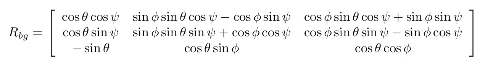
 

# Vehicule

##### Architecture

The autonomous drone in this project uses the classical perception, planning and control architecture.

This project focuses on developing the **perception** system. The **actuators**, **sensors** and **process** (i.e. the drone itself) are already implemented in the Udacity C++ simulator used in this project [3]. The **planning** and **control** systems are also part of the simulator. A series of predefined trajectories will feed waypoints to the control system during each simulation scenario. However in the last step of this project, the control system is be replaced by the control system which was developed in the 3rd project of this Nanodegree [4].

 

 
 

##### Sensors

| Sensor       | Measurement                 | Symbol                | Rate (*) | Time Step (**) |
|--------------|-----------------------------|-----------------------|----------|----------------|
| GPS          | x location - global frame   | x_tilde               | 10 Hz    | 0.1 s          |
|              | y location - global frame   | y_tilde               | 10 Hz    | 0.1 s          |
|              | z location - global frame   | z_tilde               | 10 Hz    | 0.1 s          |
|              | x speed - global frame      | x_dot_tilde, vx_tilde | 10 Hz    | 0.1 s          |
|              | y speed - global frame      | y_dot_tilde, vy_tilde | 10 Hz    | 0.1 s          |
|              | z speed - global frame      | z_dot_tilde, vz_tilde | 10 Hz    | 0.1 s          |
| IMU          | x acceleration - body frame | x_ddot_tilde^b        | 500 Hz   | 0.002 s        |
|              | y acceleration - body frame | y_ddot_tilde^b        | 500 Hz   | 0.002 s        |
|              | z acceleration - body frame | z_ddot_tilde^b        | 500 Hz   | 0.002 s        |
|              | x body rate - body frame    | p_tilde               | 500 Hz   | 0.002 s        |
|              | y body rate - body frame    | q_tilde               | 500 Hz   | 0.002 s        |
|              | z body rate - body frame    | r_tilde               | 500 Hz   | 0.002 s        |
| Magnetometer | Yaw                         | ψ_tilde               | 100 Hz   | 0.01 s         |

(*) Rate = 1 / Time Step.  
(**) Cannot be faster than the controller time step (0.002 s).

  

# Perception System

##### Overview

The perception system developed in this project is made of 2 estimators, which are described below.

Note that the inputs / outputs I used are based upon Udacity’s C++ Flight Simulator internal workings [3]. These are a little different from the methodology presented in the lectures [2] and from article [1].

 

 
 

##### Estimated State Vector

The estimation system uses the following “full” vector system internally. Different estimators inside the system will update / use different state variables from this vector.

Note that the Euler angles order in this state vector is yaw (ψ), pitch (θ), roll (Φ), which is the reverse of the conventional aerospace order. Note also that the yaw (ψ) update is shared between the attitude and position/speed estimators.

This state split is the methodology which was suggested in the Estimation course of the Nanodegree. It is a trade-off between implementation complexity, explainability and functionality. [5]

 

  

# Attitude Estimator

##### Overview

 

  

 

##### Complementary Filter

 
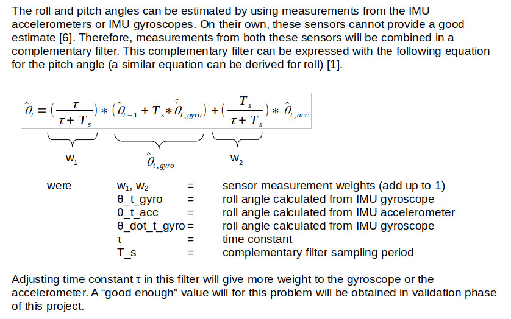
 

##### Pitch/Roll from IMU Accelerometers

 
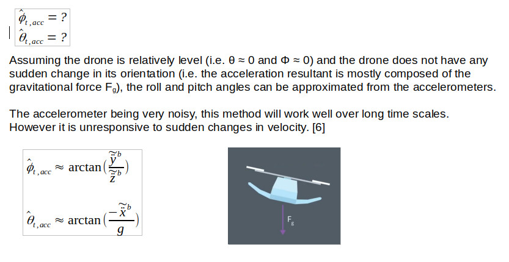
  

##### Pitch/Roll from IMU Gyroscopes

 
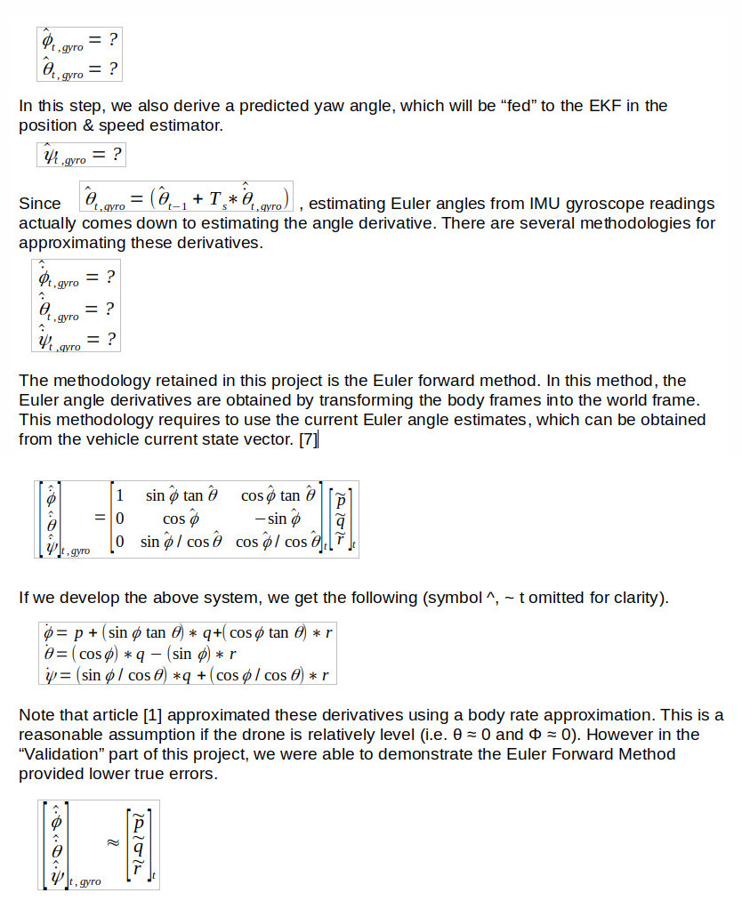
  

# Position & Speed Estimator

##### Overview

 
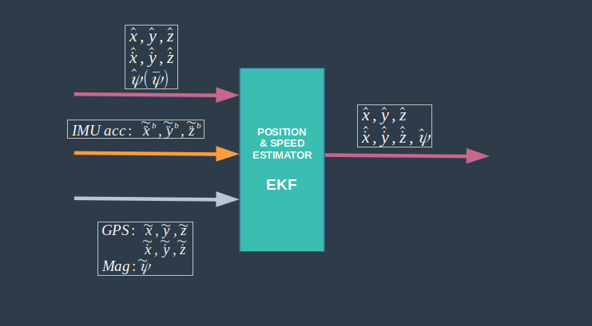
  

As its name implies, the position & speed estimator updates the position & speed state variables. It also estimates the yaw angle. This is performed using an extended Kalman filter (EKF).

As mentioned earlier, the integration of the yaw angle ψ_hat was performed in the attitude estimator. Therefore yaw “skips” the process function in the EKF and goes straight to the process covariance update step g’. So when ψ_hat enters the EKF, we can represent it as ψ_bar.

 

##### Extended Kalman Filter (EKF)

The extended Kalman Filter uses the following pseudo-code [1].

  

##### EKF Estimated State Vector

 
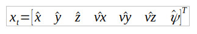
  

##### EKF Command Vector

The command vector in this project is the following and is composed of the drone accelerations in the body frame as measured by the IMU accelerometers.

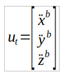
  

Note that in article [1], the command vector also contained a yaw command ψ_dot. However in this project, ψ_dot and the predicted yaw ψ_bar are calculated inside the attitude estimator. Therefore, there is no need to provide command ψ_dot to the position & speed estimator, only ψ_bar which is then used from the Jacobian G calculations and onward.
 

##### EKF Process Model (Transition Model)

The process model for the 3D drone used in this project and its Jacobian come from reference [1]. R_bg’ is the derivative of the rotation matrix R_bg with respect to yaw ψ.

Note that in the C++ implementation, the predicted yaw variable comes from the attitude estimator. So the last equation in the g function is not implemented in the EKF PREDICT() function. The Jacobian however uses all 7 state variable.

 
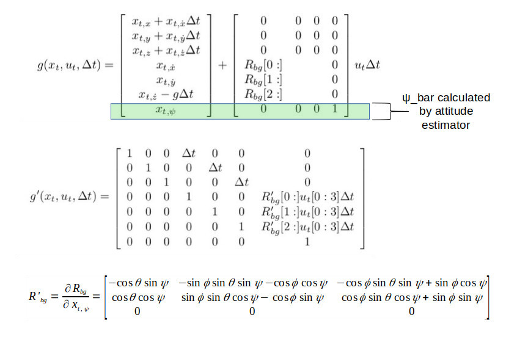
  

##### EKF Process Noise

The EKF process noise is modeled with the following assumptions.

1 - The noise is a multivariate Gaussian distribution centered at 0.
2 - The covariance matrix of this distribution is diagonal (i.e. no interaction between the state variables).
3 - Standard deviation related to x and y positions is assumed the same.
4 - Standard deviation related to the x and y velocities is assumed the same.

Diagonal terms of covariance matrix Q are tuned in the validation section of this project.

 
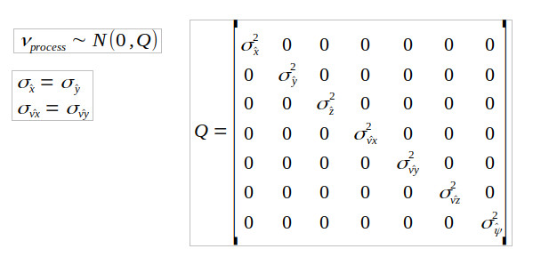
  

##### EKF Measurement Model

The measurement model for the 3D drone used in this project and its Jacobian also come from reference [1]. GPS measurements are used in the measurement update step for position and speed state variables. Magnetometer yaw is used for yaw updates.

The GPS and magnetometer measurement update step are performed separately (they end up being in different functions in the C++ implementation). Although the reason for this split was not explicitly specified in the lectures, this might be because both sensors have different update rates (10 Hz for the GPS vs 100 Hz for the magnetometer).

The image below provides the measurement vector, measurement model and measurement model Jacobian for the GPS and magnetometer.

 
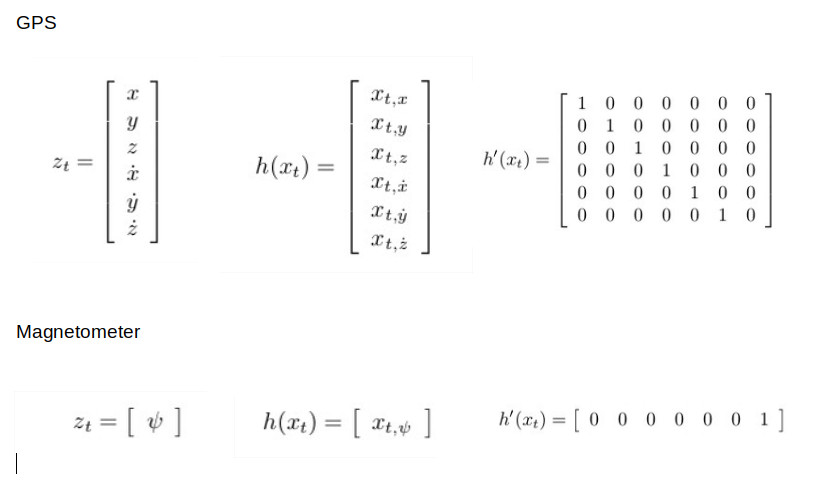
  

##### EKF Measurement Noise

EKF measurement noise is modeled using similar assumptions as with the process noise. However there is a separate noise model for the GPS and for the magnetometer.

Diagonal terms of covariance matrices R_GPS and R_mag are tuned in the validation section of this project.

 
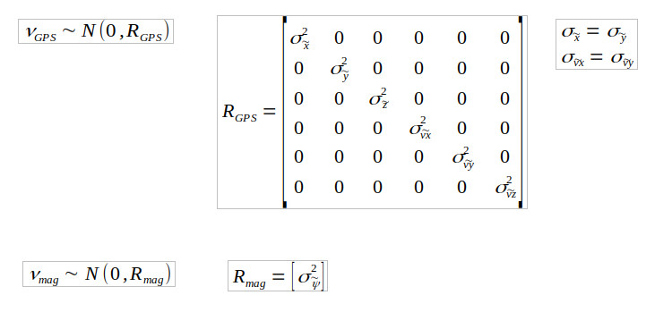
  

# Errors

##### Overview

The following errors were defined in order to help evaluate the quality of the model. Note that these errors are the same used in the Udacity C++ Flight Simulator [3].

##### True Error

Difference between any variable or vector (measured, predicted, estimated or other) and its true value.

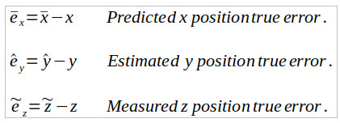
 

##### Position Magnitude Error

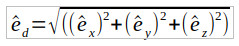
 

##### Velocity Magnitude Error

 

##### Max Euler Error

 

# Possible improvements

- Using the report structure of this project as a template for improving reports of project #2 (drone planning system [8]) and project #3 (drone control system [4]).

	- Adding an “Autonomy Architecture” diagram in project #2 and project #3
	- Adding a “Planning System Architecture” in project #2
	- Info from section “C++ Implementation” in this report which is common to project #4 and project #3 could be moved to project #3 to avoid duplication.

- In the “Attitude Estimator” and “Position/Speed Estimator” introduction, there is a small block diagram showing the inputs/outputs of each estimator. It would be great to modify these block diagrams so they show what happens in the inside of the estimator. As an example, the attitude estimator actually contains several internal steps: calculating the derivatives using a rotation matrix, sending roll and pitch to a complementary filter and integrating yaw only with dead reackoning. Each of these operations could be an internal block by itself with inputs /outputs. However these “internal” diagram are assumed beyond scope for now...

- In section “C++ Implementation”

	- Below chart “Perception System”, add small flowchart showing which method is being called by which method and at which frequency.

# References

[1] TELLEX, S., BROWN, A and LUPASHIN, S, Estimation for Quadrotors, 2021,
https://www.overleaf.com/read/vymfngphcccj

[2] Udacity's Autonomous Flight Engineer Nanodegree. https://www.udacity.com/course/flying-car-nanodegree--nd787

[3] Udacity, C++ Flight Simulator, github, https://github.com/udacity/FCND-Controls-CPP

[4] Martin Cote, Autonomous Drone Control System - Autonomous Flight Engineer Nanodegree - Project #3, https://github.com/martin0004/drone_control_system

[5] Udacity's Autonomous Flight Engineer Nanodegree, Course 4 - Estimation, Lesson 4 - The 3D EKF and UKF, Section 4 - EKF Tradeoffs 1 - State.

[6] Udacity's Autonomous Flight Engineer Nanodegree, Course 4 - Estimation, Lesson 4 - The 3D EKF and UKF, Section 6 - Attitude Estimation.

[7] Udacity's Autonomous Flight Engineer Nanodegree, Course 4 - Estimation, Lesson 2 - Introduction to Sensors, Section 10 - Full 3D Attitude Update.

[8] Martin Cote, Autonomous Drone Path Planning - Autonomous Flight Engineer Nanodegree - Project #2, https://github.com/martin0004/drone_path_planning

