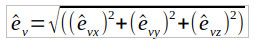
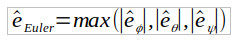
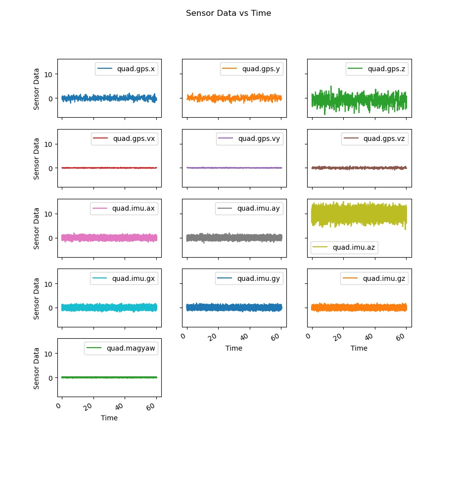
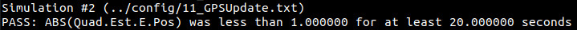

# Autonomous Drone Perception System

# Overview

This project develops a state estimation system for an autonomous drone using an Extended Kalman Filter (EKF), provides a C++ implementation of this system and performs adjustments of the system parameters in a flight simulator.

The system developed in this project is based upon a methodology by TELLEX, BROWN and LUPASHIN [1].

This project is part of Udacity's Autonomous Flight Engineer Nanodegree [2]. This README serves as a final report for the project.

 

  

# Safety First!

1 - This project is educational only. The methodology used in this project was only used in the Udacity C++ flight simulator and not validated on a real drone.

2 - Only tune the parameters of your drone by following the procedure prescribed by your drone’s manufacturer.

3 - Make sure you comply with your local regulations before flying a drone.

4 - This project makes several assumptions which may not apply on a real drone.

# Install & Run

1 - Clone this repository

	$ mkdir -p /drone/projects/perception
	$ cd /drone/projects/perception
	$ git clone https://github.com/martin0004/drone_perception_system.git

2 - Install QTCreator and the GLUT libs

	$ sudo apt install qtcreator
	$ sudo apt install qtbase5-examples    # optional - qt examples
	$ sudo apt install qtbase5-doc-html    # optional - qt examples documentation
	$ sudo apt install freeglut3-dev

3 - Compile the project.

	$ cd /drone/projects/perception    # Make sure you open qt from here when compiling
	$ qtcreator                        # This will launch QTCreator

	File > Open File Or Project > simulator/project/CPPSim.pro
	Click on tab Edit on the left side panel of QTCreator
	Right click on CPPSim > Run qmake
	Right click on CPPSim > Run

4 - You should now see a drone hover. Right click on the simulation to switch between scenarios.

5 - Look into file `QuadEstimatorEKF.txt` to find all perception system parameters. If you change a value in this file and save it, the drone behavior will change in the simulation (no need to close the simulator, just update and save the file). Try to find better system parameters!

# [Optional] Udacity Starter Code

Udacity provided students with some starter code. This starter code can be installed with the following procedure.

	mkdir -p /drone/projects/perception/udacity_starter_code
	cd /drone/projects/perception/udacity_starter_code
	git clone https://github.com/udacity/FCND-Estimation-CPP

# Udacity C++ Flight Simulator

Parameters of the system developed in this project were tweaked by flying a drone in a series of scenarios in the Udacity C++ flight simulator [3]. The tuning scenarios are described in section “Validation”.

The flight simulator itself is a small QT application. The flying area is about 5 m x 5 m and the scenarios last only a few seconds. A contextual menu allows to switch between scenarios and  display charts of the drone state variables.

  

| Simulator Command        | Action               |
|--------------------------|----------------------|
| MOUSE LEFT               | Rotate               |
| MOUSE LEFT + X           | Pan                  |
| MOUSE LEFT + Z           | Zoom                 |
| MOUSE RIGHT              | Open contextual menu |
| UP                       | Apply force up.      |
| DOWN                     | Apply force down.    |
| LEFT                     | Apply force left.    |
| RIGHT                    | Apply force right.   |
| W                        | Apply force forward. |
| S                        | Apply force back.    |
| C                        | Clear graphs.        |
| R                        | Reset simulation.    |
| SPACE                    | Pause simulation.    |

# Symbols

| Acronyms | Description                         |
|----------|-------------------------------------|
| CF       | Complementary filter.               |
| EKF      | Extended Kalman filter.             |
| GPS      | Global positioning system.          |
| IMU      | Inertial measurement unit.          |
| wrt      | Abbreviation for “with respect to”. |

| Physical Constants | Description                 |
|--------------------|-----------------------------|
| g                  | Gravitational acceleration. |

| Indices          | Description                                   |
|------------------|-----------------------------------------------|
| x (no index)     | True value of x (ground truth).               |
| x_acc            | Variable from IMU accelerometer measurement.  |
| x_GPS            | Variable from GPS measurement.                |
| x_gyro           | Variable from IMU gyroscope measurement.      |
| x^b              | Variable expressed in drone body frame.       |
| x_tilde          | Measured variable.                            |
| x_hat            | Estimated variable.                           |
| x_bar            | Predicted variable (intermediate EKF value).  |
| x_t              | Variable at time step t.                      |
| x_{t-1}          | Variable at time step t-1.                    |

| Measurement            | Description                                     |
|------------------------|-------------------------------------------------|
| x_tilde                | GPS measurement - x location - global frame.    |
| y_tilde                | GPS measurement - y location - global frame.    |
| z_tilde                | GPS measurement - z location - global frame.    |
| x_dot_tilde, vx_tilde  | GPS measurement - x speed - global frame.       |
| y_dot_tilde, vy_tilde  | GPS measurement - y speed - global frame.       |
| z_dot_tilde, vz_tilde  | GPS measurement - z speed - global frame.       |
| x_ddot_tilde^b         | IMU measurement - x acceleration - body frame.  |
| y_ddot_tilde^b         | IMU measurement - y acceleration - body frame.  |
| z_ddot_tilde^b         | IMU measurement - z acceleration - body frame.  |
| p_tilde                | IMU measurement - x body rate - body frame.     |
| q_tilde                | IMU measurement - y body rate - body frame.     |
| r_tilde                | IMU measurement - z body rate - body frame.     |
| ψ_tilde                | Magnetometer measurement - yaw - global frame.  |

| Errors        | Description                              |
|---------------|------------------------------------------|
| e_hat_x       | True error of variable or vector x_hat.  |
| e_hat_d       | Position magnitude error.                |
| e_hat_v       | Velocity magnitude error.                |
| e_hat_Euler   | Max Euler error.                         |

| State Variables | Description                                     |
|-----------------|-------------------------------------------------|
| x (*)           | State vector.                                   |
| x (*)           | Drone x position - global frame.                |
| y               | Drone y position - global frame.                |
| z               | Drone z position - global frame.                |
| x_dot, vx (**)  | Drone x speed - global frame.                   |
| y_dot, vy (**)  | Drone y speed - global frame.                   |
| z_dot, vz (**)  | Drone z speed - global frame.                   |
| Ф               | Drone attitude about x - global frame.          |
| θ               | Drone attitude about y - global frame.          |
| ψ               | Drone attitude about z - global frame.          |

(*) Depending on the context, it will be obvious if x represents a vector or a position.  
(**) Notation vx will be used when x_dot is difficult to read (e.g. when vx is used as an index).

| Filters         | Description                                                     |
|-----------------|-----------------------------------------------------------------|
| g               | EKF process model (called "transition model" in lectures)       |
| g'              | Function which derives the Jacobian of g.                       |
| G               | Jacobian of g.                                                  |
| h               | EKF measurement model.                                          |
| h'              | Function which derives the Jacobian of h.                       |
| H               | Jacobian of h.                                                  |
| Q               | Process noise covariance matrix.                                |
| R_bg            | Rotation matrix from body frame to world frame.                 |
| R_bg[0:]        | First line of R_bg.                                             |
| R_bg'           | Derivative of R_bg wrt to yaw.                                  |
| R_bg'[0:]u[0:3] | Dot product of first line of R_bg by first 3 elements of u. |
| R_GPS           | GPS measurement covariance matrix.                              |
| R_mag           | Magnetometer measurement covariance matrix.                     |
| u               | Command vector.                                                 |
| u[0:3]          | First 3 elements of u.                                          |
| x               | State vector.                                                   |
| z               | Measurement vector.                                             |
| T_s             | Complementary filter sampling period.                           |
| w_i             | Complementary filter weight for sensor measurement i.           |
| Σ_bar           | EKF predicted state covariance matrix.                          |
| Σ_hat           | EKF estimated state covariance matrix.                          |
| ν               | Noise probability distribution.                                 |
| σ_x             | Standard deviation of variable x.                               |
| τ               | Complementary filter time constant.                             |

# Units

| Units        | Description       |
|--------------|-------------------|
| m            | Distance.         |
| kg           | Mass.             |
| s            | Time.             |
| Hz           | Rate (frequency). |
| rad          | Angle.            |

# Coordinate Frames

### Body Frame

Same as in the Drone Control System project of this nanodegree [4].

### World Frame

Same as in the Drone Control System project of this nanodegree [4].

### Propeller Sign Convention

Same as in the Drone Control System project of this nanodegree [4].

### Rotation Matrix R_bg

This project use rotation matrix R_bg, which is the rotation matrix from the body frame to the world frame [1]. R_bg is a function of Euler angles Ф (pitch), θ (roll), ψ (yaw).

Euler angles Ф, θ, ψ are provided as input to any estimator which needs to derive R internally.

 

 

# Vehicule

### Architecture

The autonomous drone in this project uses the classical perception, planning and control architecture.

This project focuses on developing the **perception** system. The **actuators**, **sensors** and **process** (i.e. the drone itself) are already implemented in the Udacity C++ simulator used in this project [3]. The **planning** and **control** systems are also part of the simulator. A series of predefined trajectories will feed waypoints to the control system during each simulation scenario. However in the last step of this project, the control system is be replaced by the control system which was developed in the 3rd project of this Nanodegree [4].

 

 
 

### Sensors

| Sensor       | Measurement                 | Symbol                | Rate (*) | Time Step (**) |
|--------------|-----------------------------|-----------------------|----------|----------------|
| GPS          | x location - global frame   | x_tilde               | 10 Hz    | 0.1 s          |
|              | y location - global frame   | y_tilde               | 10 Hz    | 0.1 s          |
|              | z location - global frame   | z_tilde               | 10 Hz    | 0.1 s          |
|              | x speed - global frame      | x_dot_tilde, vx_tilde | 10 Hz    | 0.1 s          |
|              | y speed - global frame      | y_dot_tilde, vy_tilde | 10 Hz    | 0.1 s          |
|              | z speed - global frame      | z_dot_tilde, vz_tilde | 10 Hz    | 0.1 s          |
| IMU          | x acceleration - body frame | x_ddot_tilde^b        | 500 Hz   | 0.002 s        |
|              | y acceleration - body frame | y_ddot_tilde^b        | 500 Hz   | 0.002 s        |
|              | z acceleration - body frame | z_ddot_tilde^b        | 500 Hz   | 0.002 s        |
|              | x body rate - body frame    | p_tilde               | 500 Hz   | 0.002 s        |
|              | y body rate - body frame    | q_tilde               | 500 Hz   | 0.002 s        |
|              | z body rate - body frame    | r_tilde               | 500 Hz   | 0.002 s        |
| Magnetometer | Yaw                         | ψ_tilde               | 100 Hz   | 0.01 s         |

(*) Rate = 1 / Time Step.  
(**) Cannot be faster than the controller time step (0.002 s).

  

# Perception System

### Overview

The perception system developed in this project is made of 2 estimators, which are described below.

Note that the inputs / outputs I used are based upon Udacity’s C++ Flight Simulator internal workings [3]. These are a little different from the methodology presented in the lectures [2] and from article [1].

 

 
 

### Estimated State Vector

The estimation system uses the following “full” vector system internally. Different estimators inside the system will update / use different state variables from this vector.

Note that the Euler angles order in this state vector is yaw (ψ), pitch (θ), roll (Φ), which is the reverse of the conventional aerospace order. Note also that the yaw (ψ) update is shared between the attitude and position/speed estimators.

This state split is the methodology which was suggested in the Estimation course of the Nanodegree. It is a trade-off between implementation complexity, explainability and functionality. [5]

 

  

### Attitude Estimator

##### Overview

 

 

The attitude estimator is in charge of estimating the pitch and roll angles, θ_hat and Ф_hat. This is performed using a complementary filter.

Furthermore, this estimator also estimates yaw angle ψ_hat by performing a simple time step integral (i.e. dead reckoning). This is imprecise in the long run, so ψ_bar is reused later on by the EKF which performs the process covariance and measurement update on ψ. Note that the IMU runs at 500 Hz and the Magnetometer at 100 Hz, so ψ can get integrated 5 times before a measurement update in the EKF.

##### Complementary Filter

 

 

##### Pitch/Roll from IMU Accelerometers

 

  

##### Pitch/Roll from IMU Gyroscopes

 

  

### Position & Speed Estimator

##### Overview

 

  

As its name implies, the position & speed estimator updates the position & speed state variables. It also estimates the yaw angle. This is performed using an extended Kalman filter (EKF).

As mentioned earlier, the integration of the yaw angle ψ_hat was performed in the attitude estimator. Therefore yaw “skips” the process function in the EKF and goes straight to the process covariance update step g’. So when ψ_hat enters the EKF, we can represent it as ψ_bar.

 

##### Extended Kalman Filter (EKF)

The extended Kalman Filter uses the following pseudo-code [1].

  

##### EKF Estimated State Vector

 

  

##### EKF Command Vector

The command vector in this project is the following and is composed of the drone accelerations in the body frame as measured by the IMU accelerometers.

  

Note that in article [1], the command vector also contained a yaw command ψ_dot. However in this project, ψ_dot and the predicted yaw ψ_bar are calculated inside the attitude estimator. Therefore, there is no need to provide command ψ_dot to the position & speed estimator, only ψ_bar which is then used from the Jacobian G calculations and onward.
 

##### EKF Process Model (Transition Model)

The process model for the 3D drone used in this project and its Jacobian come from reference [1]. R_bg’ is the derivative of the rotation matrix R_bg with respect to yaw ψ.

Note that in the C++ implementation, the predicted yaw variable comes from the attitude estimator. So the last equation in the g function is not implemented in the EKF PREDICT() function. The Jacobian however uses all 7 state variable.

 

  

##### EKF Process Noise

The EKF process noise is modeled with the following assumptions.

1 - The noise is a multivariate Gaussian distribution centered at 0.
2 - The covariance matrix of this distribution is diagonal (i.e. no interaction between the state variables).
3 - Standard deviation related to x and y positions is assumed the same.
4 - Standard deviation related to the x and y velocities is assumed the same.

Diagonal terms of covariance matrix Q are tuned in the validation section of this project.

 

  

##### EKF Measurement Model

The measurement model for the 3D drone used in this project and its Jacobian also come from reference [1]. GPS measurements are used in the measurement update step for position and speed state variables. Magnetometer yaw is used for yaw updates.

The GPS and magnetometer measurement update step are performed separately (they end up being in different functions in the C++ implementation). Although the reason for this split was not explicitly specified in the lectures, this might be because both sensors have different update rates (10 Hz for the GPS vs 100 Hz for the magnetometer).

The image below provides the measurement vector, measurement model and measurement model Jacobian for the GPS and magnetometer.

 

  

##### EKF Measurement Noise

EKF measurement noise is modeled using similar assumptions as with the process noise. However there is a separate noise model for the GPS and for the magnetometer.

Diagonal terms of covariance matrices R_GPS and R_mag are tuned in the validation section of this project.

 

  

# Errors

##### Overview

The following errors were defined in order to help evaluate the quality of the model. Note that these errors are the same used in the Udacity C++ Flight Simulator [3].

##### True Error

Difference between any variable or vector (measured, predicted, estimated or other) and its true value.

##### Position Magnitude Error

##### Velocity Magnitude Error

##### Max Euler Error

# Implementation in C++ Flight Simulator

### Overview

The perception system developed above was implemented in Udacity’s C++ Flight Simulator [3]. Most of the code was provided by Udacity. The perception system itself had to be implemented in file `QuadEstimatorEKF.cpp` and the system parameters tuned in file `QuadEstimatorEKF.txt`.
 

### Project Directory Structure

	DIRECTORIES / FILES (*)         DESCRIPTION

	images                          Images for final report.

	simulator/                      Udacity C++ Flight Simulator (contains code for perception system).

	    config/

	        06_SensorNoise.txt      Scenario 06 configuration file.
	        ...                     ...
	        11_GPSUpdate.txt        Scenario 11 configuration file.
	        QuadEstimatorEKF.txt    Perception system configuration parameters.
			
	    config/log                  Simulation log files.
		
	    config/traj                 Trajectory definition files for simulation scenarios.
		
	    proj                        Project files (used for compiling the simulator).
		
	        CPPSim.sim              Master file for compiling with QTCreator in Linux.
			
	    src/
		
	        QuadEstimatorEKF.cpp    Main file for implementing perception system.
	        QuadEstimatorEKF.h      Contains global variables and their types (matrix, vector, ...).
		
	    validation/                 Data analysis for the "validation" phase of project.
		
	    videos/                     Videos for final report.

	(*) Only showing directories and files relevant to this project.

 

### Perception System (`QuadEstimatorEKF.cpp`)

File `QuadEstimatorEKF.cpp` is where the perception system gets implemented. Udacity provides an initial version of this file which contains a “skeleton” of the code. The image below provides an overview of the class & methods inside this file, along with how they are related.

	QuadEstimatorEKF            Class which implements the perception system
	                            (contains EKF and complementary filter CF).

		Init                    Initilizes global variables by loading configuration
		                        parameters in `QuadEstimatorEKF.txt`.

		UpdateFromIMU (*)       Update Euler angles using IMU data.

		UpdateTrueError         Update all global variables representing a true error
		                        (trueError, pitchErr, rollErr, maxEuler, ...).

		PredictState (*)        Run the process model on the EKF state vector
		                        (except for yaw).

		GetRgbPrime (*)         Derive matrix R_bg'.

		Predict (*)             Perform the entire PREDICT step of the EKF
		                        (calls PredictState under the hood).

		UpdateFromGPS (*)       EKF measurement step for GPS (speeds and velocities).

		UpdateFromMag (*)       EKF measurement update for magnetometer (yaw).

		Update                  Generic helper function called by UpdateFromGPS and UpdateFromMag.						
		GetData                 Helper function for plotting graphs.

		GetFields               List of fields for plotting estimation errors.

	(*) Content of this method implemented by student.

### Configuration Parameters (`QuadEstimatorEKF.txt`)

The perception system configuration parameters are available in file `QuadEstimatorEKF.txt`. The simulator comes with some default values which are tuned throughout the validation phase.

The content of this file is loaded when a scenario starts in order to initialize several global variable (see next paragraph). Note that if you change a value in this file, you do not need to restart the simulator. The new parameter values will take effect as soon as the scenario is reset (you can also type “R” on your keyboard to reset the scenario faster). This allows for interactive tuning of these parameters.

| Parameter   | Default Values              | Description                                                    | Variable   in Report    |
|-------------|-----------------------------|----------------------------------------------------------------|----------------------------|
| InitState   | 0, 0, -1, 0, 0, 0, 0        | EKF estimated state vector - initial values.                   | x_hat                      |
| InitStdDevs | .1, .1, .3, .1, .1, .3, .05 | EKF estimated and predicted covariance matrix - initial values | Σ_hat, Σ_bar               |
| QPosXYStd   | 0.05                        | Process noise standard deviation - x,y positions.              | σ_{hat x}, σ_{hat_y}       |
| QPosZStd    | 0.05                        | Process noise standard deviation - z position.                 | σ_{hat z}                  |
| QVelXYStd   | 0.05                        | Process noise standard deviation - x, y speeds.                | σ_{hat vx}, σ_{hat vy}     |
| QVelZStd    | 0.10                        | Process noise standard deviation - z speed.                    | σ_{hat vz}                 |
| QYawStd     | 0.05                        | Process noise standard deviation - yaw.                        | σ_{hat ψ}                  |
| GPSPosXYStd | 1                           | Measurement noise standard deviation - GPS - x,y positions.    | σ_{tilde x}, σ_{tilde y}   |
| GPSPosZStd  | 3                           | Measurement noise standard deviation - GPS - z position.       | σ_{tilde z}                |
| GPSVelXYStd | 0.1                         | Measurement noise standard deviation - GPS - x,y velocities.   | σ_{tilde vx}, σ_{tilde vy} |
| GPSVelZStd  | 0.3                         | Measurement noise standard deviation - GPS - z velocity.       | σ_{tilde vz}               |
| MagYawStd   | 0.1                         | Measurement noise standard deviation - magnetometer - yaw.     | σ_{tilde ψ}                |
| dtIMU       | 0.002                       | Complementary filter sampling period.                          | T_s                        | 
| attitudeTau | 100                         | Complementary filter time constant.                            | τ                          |

### Global Variables (`QuadEstimatorEKF.h`)

The following global variables are used throughout the perception system implementation. Theses global variables are initialized in files `QuadEstimatorEKF.h` and `QuadEstimatorEKF`.

| Variable   in Simulator | Type   (Rows, Cols) | Value   | Description                                         | Variable   in Report |
|----------------------------|------------------------|---------|-----------------------------------------------------|-------------------------|
| QUAD_EKF_NUM_STATES        | int                    | 7       | Number of variables in EKF estimated state vector.  | -                       |
| Q                          | MatrixXf(7,7)          | (*)     | Process noise covariance matrix.                    | Q                       |
| R_GPS                      | MatrixXf(6,6)          | (*)     | Measurement noise covariance matrix (GPS).          | R_GPS                   |
| R_mag                      | MatrixXf(1,1)          | (*)     | Measurement noise covariance matrix (magnetometer). | R_mag                   |
| ekfState                   | VectorXf(7)            | (**)    | EKF estimated state vector.                         | -                       |
| ekfCov                     | VMatrixXf(7,7)         | (**)    | EKF predicted and estimated covariance matrix.      | Σ_hat, Σ_bar            |
| attitudeTau                | float                  | (*)     | Complementary filter time constant.                 | τ                       |
| dtIMU                      | float                  | (*)     | Complementary filter sampling period.               | T_s                     |
| trueError                  | VectorXf(7)            | All 0’s | Estimated state vector true error.                  | e_hat_x                 |
| pitchErr                   | float                  | 0       | Estimated pitch true error.                         | e_hat_θ                 |
| rollErr                    | float                  | 0       | Estimated roll true error.                          | e_hat_ϕ                 |
| maxEuler                   | float                  | 0       | Max Euler true error.                               | e_hat_Euler             | 
| posErrorMag                | float                  | 0       | Position magnitude true error.                      | e_hat_d                 |
| velErrorMag                | float                  | 0       | Velocity magnitude true error.                      | e_hat_v                 |

(*)  Initialized from configuration parameters. Constant throughout the simulation.
(**) Initialized from configuration parameters. Not constant throughout the simulation.

### Trajectory Definition Files (`config/traj`)

Directory `config/traj` contains trajectory definitions for some scenarios. Most of these files consist of a time value and a target state for this time. Data from these files can help better understand a troubleshoot a scenario.

### Scenario Definition Files (`config/`)

Directory `config` contains the scenario definition files for this project. Note that this project focuses only on scenarios 6 to 11, which are described in the “Validation” part of this project. Take time to look at a configuration file before running a scenario to better understand what is happening under the hood.

Common parameters for scenarios are the initial pose (x, y, z) and trajectory used in the scenario. Here is an example from scenario 7.

  

You can see which sensors are used by a scenario in section `# Sensors` of a configuration file. Some scenarios also use “perfect” sensors with no noise. This is accomplished by setting the noise measurement standard deviations to 0 for these sensors. Playing with these parameters can help troubleshoot the simulation. Here is an example from scenario 7, which only uses a “perfect” IMU.

 

  

# Validation in C++ Flight Simulator

### Step 1 - Sensors Noise Characterization

##### Objectives

- Calculate measurement noise standard deviations for the GPS x position and the IMU x accelerometer.
- [Optional] Derive standard deviations values for all other sensors.
- [Optional] Derive mean values for all sensors.

##### Success Metrics

- Standard deviations for GPS x position and IMU x acceleration must capture 68% of noise values.

##### Scenario

- `06_NoisySensors`
- Drone hovering 1 m above the ground.
- All sensors (IMU, Magnetometer and GPS) are activated and all have noise.

 

  

##### Methodology & Analysis

- Sensor data was collected from all sensors over 60 s (I had to comment line `Sim.RunMode` in the scenario configuration file). Below we can see data for all 13 sensors. All seem to have a random behavior. Most of them are centered around 0, except for GPS z position (around 1 m above ground, which is consistent with the scenario initial conditions) and IMU az value (centered around +g).

 

  

- A sanity check was performed to see if noise data distributions are relatively Gaussian. Histograms were plotted for all data and confirmed the Gaussian distributions.

 

  

- Another question before extracting standard deviations is to make sure we have enough data points so σ and μ have converged, which is the case (values seem to relatively converge after 30 s).

 

 

  

##### Results

| Sensor      |   μ   |   σ  |
|-------------|-------|------|
| quad.gps.x  |  0.03 | 0.69 |
| quad.gps.y  |  0.02 | 0.73 |
| quad.gps.z  | -1.05 | 2.01 |
| quad.gps.vx |  0.00 | 0.10 |
| quad.gps.vy |  0.00 | 0.10 |
| quad.gps.vz | -0.02 | 0.30 |
| quad.imu.ax | -0.01 | 0.50 |
| quad.imu.ay |  0.00 | 0.50 |
| quad.imu.az |  9.82 | 1.51 |
| quad.imu.gx |  0.00 | 0.51 |
| quad.imu.gy |  0.00 | 0.50 |
| quad.magyaw |  0.00 | 0.10 |

Standard deviations for the GPS x postion and IMU x accelerations are injected at the top of the scenario configuration file (line `Sim.RunMode` is also uncommented to reactivate the max simulation time). Standard deviation capture 68 % of noise, which is was the target metric.

  

  

##### Note

Although this was not specifically mentioned in the project instructions, measurement noise standard deviations derived above were injected into file QuadEstimatorEKF.txt

  

### Step 2 - Attitude Estimation

##### Objective(s)

- Implement the attitude estimator.

##### Success Metrics

- Max Euler error must be less than 0.1 rad for 3 s.

##### Scenario

- `07_AttitudeEstimation`
- Drone is hovering 1 m above the ground.
- Only the IMU is activated and its noise levels are set to 0.
- The drone receives a series of impulse commands which will change its attitude.
	- t = 0.1 s, impulse in positive x direction
	- t = 1.0 s, impulse in negative y direction
	- t = 1.9 s, impulse in negative x-and-y direction
	- t = 3~4 s, series of yaw commands

  

##### Methodology & Analysis

- UpdateFromIMU() came with a filter using the body rate approximation (method used in article [1]). UpdateFromIMU() was updated with the Euler forward method. Euler angle errors were compared for both methods. We can clearly see the Euler forward method yields a much smaller error (see below). This error also matches the target max Euler error of 0.1 rad.

- The simulator default value for τ (100) provided good results and was kept as-is.

##### Results

  

  

  

### Step 3-A - Prediction Step (No Noise)

##### Objective(s)

- Implement the state update of the prediction step.

##### Success Metrics

- Capture the drone predicted positions and speeds (qualitative).

##### Scenario

- `08_PredictState`
- A drone follows a square trajectory 1 m above ground.
- Only the IMU is activated and its noise levels are set to 0.

  

##### Methodology & Analysis

- The process model was implemented in method PredictState(). Note that this method implements the process model only. The covariance update will be taken care of in another method in step 3-B.

- Note that after implementing the process model, we do observe a slow drift of estimated states, which is to be expected since the measurement update step is not implemented yet.

##### Results

  

- The charts allowed to do a qualitative validation that the predicted state update (positions and speeds) was implemented correctly.

### Step 3-B - Prediction Step (With Noise)

##### Objective(s)

- Implement the covariance update of the prediction step.

##### Success Metrics

- Capture the quad predicted position/speed standard deviations (qualitative).

##### Scenario

- `09_PredictionCov`
- 10 identical drones at the same location hovering 1 m above ground.
- Only the IMUs are activated and their noise is also activated.

  

##### Methodology & Analysis

- Method R_bg_prime was implemented with the R_bg_prime matrix calculation.
- Method Predict() was completed to include the predicted covariance.
- Process noise parameters QPosXYStd and QVelXYStd were tuned using trial-and-error (the Z terms will be updated in a later step). The following values provided reasonnable results.
	- QPosXYStd = 0.06
	- QVelXYStd = 0.20
- With the above implementation, the following charts are plotted by the simulator.
- The colored lines represent the 10 drones predicted x positions and x velocities. Note that the drones aren’t moving and yet their positions/speeds are slowly drifting, which is normal since the measurement update is not implemented yet.
- The white lines represent the predicted covariance for the drone 1 x-position and x-velocies (these curves are the same for all drones). This covariance grows with the same behavior as the predicted positions and speeds. This is an indicator the process noise values are representative of reality and that the methods were correctly implemented.

##### Results

  

- The charts allowed to do a qualitative validation that the predicted covariance update (positions and speeds) was implemented correctly.

### Step 4 - Magnetometer Update

##### Objective(s)

- Implement the magnetometer measurement update.

##### Success Metrics

- Estimated yaw true error must be less than 0.1 rad for at least 10 s.
- Estimated yaw standard deviation must capture the error during most of the scenario (specific time not mentioned in instructions...).

##### Scenario

- `10_MagUpdate`
- Drone following a square trajectory 1 m above ground (scenario similar to step 3-A).
- Now the IMU and magnometer are activated and they both have noise.

  

##### Methodology & Analysis

- Magnetometer measurement update was implemented in method UpdateFromMag().

- Process noise parameter QYawStd was tuned by using trial and errors. The following value provided reasonnable results.
	- QYawStd = 0.08

- Charts of yaw and yaw error were obtained from the simulator before and after the measurement update and yaw noise were implemented (see below). Before this implementation, we can clearly see a drift in estimated yaw. The error remains less than 0.1 after implementation.

- Note that there is an extra line in the bottom chart representing estimated yaw standard deviation.

- There is are sudden “jumps” in magnetometer readings. This is only due to the yaw value oscillating around pi rads (180o). Since yaw is measured from -pi rad (-180o) to pi rad (180o), when the angle is close to these values the noise may cause the reading value to jump ±2pi rad (360o).

##### Results

  

  

### Step 5 - GPS Update

##### Objective(s)

- Implement the GPS measurement update.

##### Success Metrics

- Estimated position true error must be less than 1 m for entire simulation.

##### Scenario

- `11_GPSUpdate`
- Drone following a square trajectory 1 m above ground (scenario similar to step 3-A).
- All sensors (IMU, Magnetometer and GPS) are activated and all have noise.
- By default this scenario uses an ideal estimator and sensors do not have noise. Disable the ideal estimator by setting Quad.UseIdealEstimator to 0 and commenting lines SimIMU.AccelStd and SimIMU.GyroStd.

  

##### Methodology & Analysis

- GPS measurement update was implemented in method UpdateFromGPS().

- Process noise parameters (QPosXYStd, QPosZStd, QVelXYStd, QVelZStd and QYawStd) current values were good enough to meet the requirements. No additional tuning was performed.

##### Results

|       Before tuning             |         After tuning         |
|---------------------------------|------------------------------|
|  |   |

  

### Step 6 - Adding My Controller

##### Objective(s)

- Replace the control system with the one I developped in project 3 of this Nanodegree [4].

##### Success Metrics

- Estimated position true error must be less than 1 m for entire simulation.

##### Scenario

- `11_GPSUpdate` (same as in step 5, with noise still active).

##### Methodology & Analysis

- Files `QuadController.cpp` and `QuadControlParams.txt` were replaced by the ones I developped in project 3 [4].

- Following this change of controller, the drone trajectory met the 1 m error requirement. However the drone behavior was erratic. Position and velocity control gains were re-tuned by using trial and error. The following values greatly improved the drone behavior.

  

##### Results

|       Before tuning             |         After tuning         |
|---------------------------------|------------------------------|
|  |   |

  

- Also: following this change of controller, scenarios 6-10 were re-run to confirm requirements were still met.

# Possible Improvements

- Using the report structure of this project as a template for improving reports of project #2 (drone planning system [8]) and project #3 (drone control system [4]).

	- Adding an “Autonomy Architecture” diagram in project #2 and project #3
	- Adding a “Planning System Architecture” in project #2
	- Info from section “C++ Implementation” in this report which is common to project #4 and project #3 could be moved to project #3 to avoid duplication.

- In the “Attitude Estimator” and “Position/Speed Estimator” introduction, there is a small block diagram showing the inputs/outputs of each estimator. It would be great to modify these block diagrams so they show what happens in the inside of the estimator. As an example, the attitude estimator actually contains several internal steps: calculating the derivatives using a rotation matrix, sending roll and pitch to a complementary filter and integrating yaw only with dead reackoning. Each of these operations could be an internal block by itself with inputs /outputs. However making these “internal” block diagrams are an extra effort which is beyond scope for now...

- In section “C++ Implementation”

	- Below chart “Perception System”, add small flowchart showing which method is being called by which method and at which frequency.

# References

[1] TELLEX, S., BROWN, A and LUPASHIN, S, Estimation for Quadrotors, 2021,
https://www.overleaf.com/read/vymfngphcccj

[2] Udacity's Autonomous Flight Engineer Nanodegree. https://www.udacity.com/course/flying-car-nanodegree--nd787

[3] Udacity, C++ Flight Simulator, github, https://github.com/udacity/FCND-Controls-CPP

[4] Martin Cote, Autonomous Drone Control System - Autonomous Flight Engineer Nanodegree - Project #3, https://github.com/martin0004/drone_control_system

[5] Udacity's Autonomous Flight Engineer Nanodegree, Course 4 - Estimation, Lesson 4 - The 3D EKF and UKF, Section 4 - EKF Tradeoffs 1 - State.

[6] Udacity's Autonomous Flight Engineer Nanodegree, Course 4 - Estimation, Lesson 4 - The 3D EKF and UKF, Section 6 - Attitude Estimation.

[7] Udacity's Autonomous Flight Engineer Nanodegree, Course 4 - Estimation, Lesson 2 - Introduction to Sensors, Section 10 - Full 3D Attitude Update.

[8] Martin Cote, Autonomous Drone Path Planning - Autonomous Flight Engineer Nanodegree - Project #2, https://github.com/martin0004/drone_path_planning

